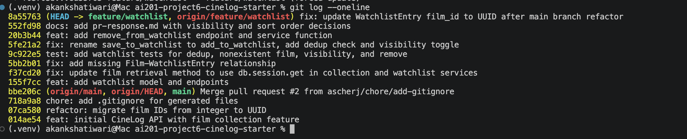

# PR Response Doc — CineLog Watchlist Feature

## AI Usage
I used an AI assistant throughout this project for orientation and implementation support. Specifically:
- Asked it to explain how `add_to_collection()` handles deduplication and film-not-found errors before writing the equivalent watchlist logic myself.
- Asked it to help me trace an `AttributeError: 'WatchlistEntry' object has no attribute 'film'` test failure — it helped me identify that `Film` was missing a `backref` relationship to `WatchlistEntry` (present for `CollectionEntry` but not `WatchlistEntry`), which I then fixed in `models.py`.
- Used it as a devil's advocate on my Comment 4 and Comment 5 draft positions before finalizing them (see notes under each comment below).
I did not ask AI to write my Comment 4 or Comment 5 arguments for me — I wrote my own position first, then used AI to stress-test it.

## Comment 1 — Rename
**What I did:** Renamed `save_to_watchlist()` to `add_to_watchlist()` in `services/watchlist_service.py`, matching the project's `verb_to_noun` convention used by `add_to_collection()`. Updated the one call site in `routes/watchlist/watchlist.py`.
**How I verified:** Searched the codebase for all references to `save_to_watchlist` to confirm only one call site existed, then ran the full test suite to confirm no other references were missed.

## Comment 2 — Deduplication
**What I did:** Added a check in `add_to_watchlist()` that queries for an existing `WatchlistEntry` with the same `user_id` and `film_id` before inserting a new one. If found, raises a new `AlreadyInWatchlistError`, mirroring `AlreadyInCollectionError`'s pattern in `collection_service.py`.
**How I verified:** Wrote `test_add_to_watchlist_duplicate_raises`, confirming the second call raises the error and only one entry persists in the database.

## Comment 3 — Missing test
**What I did:** Created `tests/test_watchlist.py` and wrote `test_add_to_watchlist_nonexistent_film_raises`, following the same fixture and assertion structure as `test_add_to_collection_nonexistent_film_raises` in `test_collection.py`.
**How I verified:** Ran `pytest tests/test_watchlist.py -v` and confirmed the test passes and raises `FilmNotFoundError` as expected.

## Comment 4 — Default visibility
**My position:** Keep the existing `public=True` default for watchlist entries, but add an explicit `public` parameter to `add_to_watchlist()` so callers can opt out per entry rather than silently inheriting the default.
**Reasoning:** A watchlist entry only signals intent to watch something — it doesn't expose an opinion or rating the way a collection entry might. Public-by-default supports the social/discovery use cases a film-tracking app is generally built around (friends seeing what you're planning to watch). Making it public by default also matches user expectations set by comparable platforms, so it's not an unusual choice to have to explain away later.
**Tradeoff acknowledged:** Some users may not want their in-progress taste visible before they've watched or rated anything, and a single global default can't fully account for that. I mitigated this by exposing the `public` parameter explicitly on `add_to_watchlist()` (see stretch feature below) so visibility becomes a conscious per-entry choice rather than an invisible inherited default.

## Comment 5 — Sort order
**My position:** Keep the existing alphabetical sort (`Film.title.asc()`) as the watchlist default rather than switching to date-added order.
**Reasoning:** A watchlist and a collection serve different mental models. `get_collection()` correctly sorts newest-first because a collection is a log of past activity, where recency is exactly what a user wants to review. A watchlist, by contrast, is a list users return to repeatedly over weeks to decide what to watch next — a browsing/lookup task, not a recall-what-I-did-recently task. Under date-added order, films added weeks ago sink to the bottom and become effectively invisible, which undermines the entire purpose of a watchlist.
**Engagement with reviewer's point:** The reviewer's reasoning ("most users want to see what they added recently") is valid, but I think it describes a feed-browsing behavior, not a watchlist-lookup behavior. I'd propose that need is better served by a separate "recently added" filter or view in a future iteration, rather than by changing the default sort of the whole list.

## Comment 6 — Rebase
**What conflicted:** Rebasing onto `origin/main` surfaced a merge conflict in `.gitignore` (both branches independently added one — resolved by keeping the union of both lists). More importantly, a *silent* logical conflict existed that git did not flag as text: `main`'s refactor (`refactor: migrate film IDs from integer to UUID`) changed `Film.id` from `db.Integer` to `db.String(36)`, but `WatchlistEntry.film_id` — introduced only on my branch — still referenced the old integer type. Because `WatchlistEntry` didn't exist yet in `main`'s history, git had no overlapping lines to flag as a conflict, so this mismatch didn't surface until I ran the test suite after the rebase completed.
**How I resolved it:** Updated `WatchlistEntry.film_id` in `models.py` from `db.Integer` to `db.String(36)` to match the UUID refactor. Also updated stale docstrings in `watchlist_service.py` that still described `film_id` as an `int`, and fixed a test (`test_add_to_watchlist_nonexistent_film_raises`) that used an integer placeholder (`999999`) for a nonexistent film ID, replacing it with a UUID-shaped string to match the pattern already established in `test_collection.py`.
**How I verified no conflict remains:** Ran `pytest tests/ -v` immediately after the rebase and after each subsequent fix — all 12 tests pass, confirming both the collection and watchlist services work correctly against the UUID-based `Film` model. This experience was a useful reminder that resolving a rebase isn't just about clearing `<<<<<<<` markers — a conflict can be logically real even when git doesn't detect it as a text conflict.

## Stretch Features
**`remove_from_watchlist(user_id, film_id)`:** Implemented following the existing naming and lookup pattern from `add_to_watchlist()`. Raises a new `NotInWatchlistError` if the entry doesn't exist. Covered by `test_remove_from_watchlist_deletes_entry` and `test_remove_from_watchlist_not_present_raises`.

**Second test (my choice of edge case):** `test_get_watchlist_sorts_alphabetically` — verifies mixed-case titles ("zombie flick" vs "Alien") still sort correctly under the alphabetical ordering from Comment 5, since case-sensitivity in SQL sort collations can be an easy source of silent bugs.

**Visibility toggle:** Added an optional `public` parameter to `add_to_watchlist()` (default `True`, per Comment 4's decision) and wired it through the `/watchlist/<user_id>/add` POST endpoint so callers can explicitly set visibility instead of relying on the implicit default. Covered by `test_add_to_watchlist_defaults_to_public` and `test_add_to_watchlist_can_be_set_private`.

## PR Description

### What this feature does
Adds a watchlist feature to CineLog, allowing users to save films they intend to watch later, separate from their collection of already-watched films. Includes:
- A `WatchlistEntry` model with UUID-based film references (aligned with the recent `main` refactor)
- `add_to_watchlist()`, `remove_from_watchlist()`, and `get_watchlist()` service functions
- REST endpoints: `GET /watchlist/<user_id>`, `POST /watchlist/<user_id>/add`, `POST /watchlist/<user_id>/remove`
- Deduplication so a film can't be added to the same watchlist twice
- Full test coverage in `tests/test_watchlist.py`

### Design decisions
1. **Default visibility (`public=True`)** — Watchlist entries default to public, since they only signal viewing intent rather than an opinion or rating, and this supports discovery/social use cases common to film-tracking apps. Callers can override this per-entry via the new `public` parameter on `add_to_watchlist()`. Full reasoning in Comment 4 above.
2. **Sort order (alphabetical, not date-added)** — Watchlists are kept sorted alphabetically by title rather than by date added, since a watchlist is a repeatedly-revisited browsing list, not a recency-based activity log (unlike collections, which correctly sort newest-first). Full reasoning in Comment 5 above.

### How to manually test
1. Start the app: `python app.py`
2. Create a user and a film via the existing endpoints (or use `flask shell` / a seed script if the project has one) and note their IDs.
3. Add a film to the watchlist:
curl -X POST http://127.0.0.1:5000/watchlist/<user_id>/add 
-H "Content-Type: application/json" 
-d '{"film_id": "<film_id>"}'
4. View the watchlist and confirm the film appears, sorted alphabetically if you add more than one:
curl http://127.0.0.1:5000/watchlist/<user_id>
5. Try adding the same film again — confirm it returns an error rather than a duplicate entry.
6. Add the film with explicit visibility:
curl -X POST http://127.0.0.1:5000/watchlist/<user_id>/add 
-H "Content-Type: application/json" 
-d '{"film_id": "<film_id_2>", "public": false}'
7. Remove a film from the watchlist:
curl -X POST http://127.0.0.1:5000/watchlist/<user_id>/remove 
-H "Content-Type: application/json" 
-d '{"film_id": "<film_id>"}'
8. Run the automated test suite to confirm everything passes: `pytest tests/ -v`

